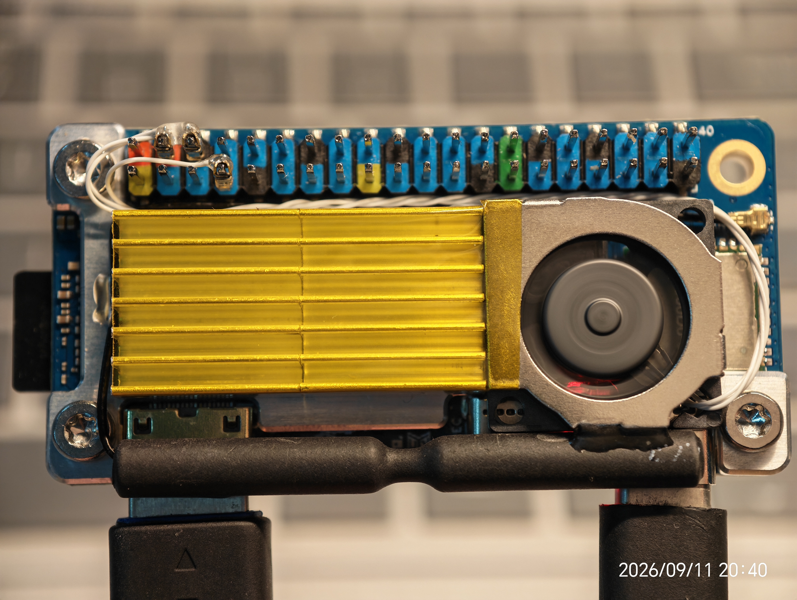
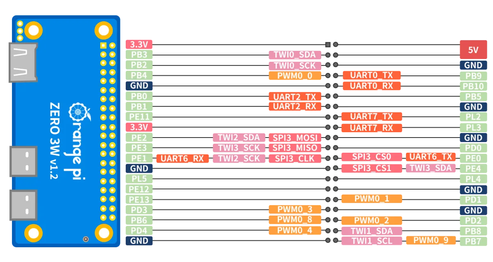

# OrangePiZero3W-FanControl

香橙派 **Zero3W** 温控散热风扇完整方案:定制 CNC 铝合金散热器 + 2004/2006 微型 PWM 风扇 + Python 温控脚本(开机自启动)。

按 CPU 温度自动调速,**35°C 以下停转、60°C 以上全速、中间线性过渡**,低负载安静、高负载压得住(满载实测约 62°C)。新手按本文档操作即可复现整套硬件与软件部署。

> 配套图片:引脚功能图见 [`img/pin_map.webp`](img/pin_map.webp),实际接线示意图见 [`img/pin_connection.jpg`](img/pin_connection.jpg)。





---

## 目录

- [特性](#特性)
- [硬件部分](#硬件部分)
  - [材料清单 BOM](#材料清单-bom)
  - [CNC 加工(铨洲智造)](#cnc-加工铨洲智造)
  - [接线方法](#接线方法)
- [软件部署](#软件部署)
  - [系统准备:启用 PWM0 overlay](#系统准备启用-pwm0-overlay)
  - [方式一:一键安装(推荐)](#方式一-一键安装推荐)
  - [方式二:手动安装](#方式二手动安装)
- [验证与测试](#验证与测试)
- [温控曲线与调参](#温控曲线与调参)
- [工作原理](#工作原理)
- [实测数据](#实测数据)
- [目录结构](#目录结构)
- [常见问题 FAQ](#常见问题-faq)
- [许可](#许可)

---

## 特性

- ✅ **35°C 停转 ~ 60°C 全速**的线性温控曲线,兼顾散热与噪音
- ✅ **滞回防抖**:超过 36.5°C 才启动、低于 35°C 才停转,避免临界温度反复启停
- ✅ **起转保护**:启动瞬间以 100% 占空比"踢一脚"0.6 秒,确保低转速下可靠起转
- ✅ **最低运行占空比 25%**:防止风扇在低占空比下堵转/异响
- ✅ **EMA 平滑**:转速渐变,无突然加速的噪音
- ✅ **安全兜底**:温度读取失败或程序异常退出时,风扇自动置为全速;服务崩溃自动重启
- ✅ **极性自适应**:本板 PWM 输出极性为 `inversed`(引脚波形与 sysfs 反相),脚本自动取反映射,保证"脚本里的占空比 % = 实际转速 %"
- ✅ **纯 Python 标准库**实现,无第三方依赖,占用约 6MB 内存

---

## 硬件部分

### 材料清单 BOM

| 名称 | 规格 | 数量 | 说明 |
| --- | --- | --- | --- |
| 香橙派 Zero3W | — | 1 | 本项目验证于官方镜像 Ubuntu 22.04(Orange Pi 1.0.0 Jammy),内核 `6.6.98-sun60iw2` |
| CNC 散热器 | 图纸见 `cad_files/` | 1 | 铝合金,推荐铨洲智造加工 |
| 微型风扇 | **2004**(20×20×4 mm)或 **2006**(20×20×6 mm),**支持 PWM 调速**,5V(以风扇铭牌为准) | 1 | 图纸参考型号 SENKAYS 2006 |
| 连接线 | 杜邦线等 | 若干 | 接线见下方图示 |
| 固定螺丝 | 按图纸 | 若干 | 散热器与主板固定用 |

### CNC 加工(铨洲智造)

`cad_files/` 目录内为 SolidWorks 图纸:

| 文件 | 说明 | 是否加工 |
| --- | --- | --- |
| `OrangePiZero3W.SLDASM` | 整机装配体(含风扇、主板、散热器) | 参考 |
| `HeatSink.SLDPRT` | 散热器主体 | ✅ 加工件 |
| `BottomShell.SLDPRT` | 底部安装板/外壳 | ✅ 加工件 |
| `Single16x16x6.SLDPRT` | 16×16×6 mm 散热鳍片单体 | ✅ 加工件 |
| `Zero3W.SLDPRT` | 香橙派 Zero3W 主板模型 | 参考(非加工) |
| `Fan 2006 (SENKAYS).SLDASM` | 2006 风扇装配体(SENKAYS 型号) | 参考(外购件) |

下单流程:

1. 打开铨洲智造官网/小程序,**上传需加工的零件图**(建议同时另存一份 **STEP** 格式,兼容性最好);
2. 选择材料(建议 **6061 铝合金**)与表面处理(建议**喷砂 + 阳极氧化**,利于散热与绝缘);
3. 平台自动报价,确认后下单即可。

> 图纸为标准 SolidWorks 格式,也可交给任意支持来图加工的 CNC 厂家;更换厂家时建议用 STEP 格式传图。

### 接线方法

将风扇连接到 Zero3W 的 26pin 排针:

| 风扇线 | 接到 Zero3W | 说明 |
| --- | --- | --- |
| **PWM 调速线** | **PWM0(PB4)引脚** | 具体位置见 [`img/pin_map.webp`](img/pin_map.webp) |
| 正极(+) | 5V 引脚(排针 2/4 脚) | 若风扇是 3.3V 版本,接 3.3V(排针 1/17 脚) |
| 负极(-) | GND 引脚(排针 6/9/14/20/25 任一脚) | — |

实际接线请对照照片 [`img/pin_connection.jpg`](img/pin_connection.jpg)。

> ⚠️ **注意**:正负极接反可能损坏风扇;通电前请先对照照片与引脚图确认。PB4 的 PWM 输出在本项目中只用于传输调速信号,风扇供电来自 5V/GND。

---

## 软件部署

### 系统准备:启用 PWM0 overlay

脚本通过 `/sys/class/pwm/pwmchip0` 控制 PB4 的 PWM 输出,需要先启用设备树 overlay(**新烧录的系统默认未启用**):

**方式一(图形界面,推荐新手)**:

```bash
sudo orangepi-config
# System -> Hardware -> 找到 pwm0 勾选 -> Save -> 重启
```

**方式二(直接改配置)**:

```bash
# 编辑 /boot/orangepiEnv.txt,在 overlays= 行添加 pwm0(多个 overlay 用空格分隔)
sudo nano /boot/orangepiEnv.txt
# 例如: overlays=pwm0
sudo reboot
```

**验证是否生效**:

```bash
ls /sys/class/pwm/
# 能看到 pwmchip0 即成功;看不到请检查上面的步骤
```

> 说明:官方镜像默认账号 `orangepi` / 密码 `orangepi`(若你已修改请用你自己的);Armbian 用户可在 `sudo armbian-config` 的 Hardware 里启用 PWM overlay,操作类似。

### 方式一:一键安装(推荐)

在开发板上执行:

```bash
# 安装 git(已装可跳过)
sudo apt update && sudo apt install -y git

# 下载本项目
git clone https://github.com/iowqi/OrangePiZero3W-FanControl.git
cd OrangePiZero3W-FanControl

# 一键安装:复制脚本到系统目录 + 注册并启动 systemd 服务
sudo bash install.sh
```

安装完成后会打印服务状态,看到 `active (running)` 即成功。**之后每次重启开发板,服务都会自动启动**,无需任何手动操作。

后续更新脚本:

```bash
cd ~/OrangePiZero3W-FanControl
git pull
sudo bash install.sh
```

### 方式二:手动安装

适合没有 git / 离线环境。在**电脑上**把文件传到板子:

```bash
scp pwm-fan.py pwm-fan.service orangepi@<板子IP>:~/
```

然后 SSH 登录开发板:

```bash
sudo install -m 0755 -o root -g root ~/pwm-fan.py /usr/local/sbin/pwm-fan.py
sudo install -m 0644 -o root -g root ~/pwm-fan.service /etc/systemd/system/pwm-fan.service
sudo systemctl daemon-reload
sudo systemctl enable --now pwm-fan.service
```

---

## 验证与测试

```bash
# 1. 服务状态(active (running) 即正常)
systemctl status pwm-fan

# 2. 实时日志:每行显示 "温度 xx.x°C -> 占空比 xx%"
journalctl -u pwm-fan -f

# 3. 查看当前温度与 PWM 状态
sudo /usr/local/sbin/pwm-fan.py --show

# 4. 手动让风扇以 50% 转速转起来(测试风扇与接线是否正常)
sudo /usr/local/sbin/pwm-fan.py --test 50
```

**满载压测(可选)**:开 4 个满载进程,观察日志中温度升到 60°C 以上时占空比自动拉到 100%:

```bash
for i in 1 2 3 4; do yes > /dev/null & done
journalctl -u pwm-fan -f
# 观察结束后停掉压测: pkill yes
```

**重启自启动验证**:`sudo reboot` 后重新登录,执行 `systemctl status pwm-fan`,服务应在开机几秒内自动运行。

---

## 温控曲线与调参

默认曲线(**需求值:35°C=0%,60°C=100%**):

| 温度 | 目标转速 |
| --- | --- |
| ≤ 35°C | 0%(停转) |
| 35 ~ 60°C | 线性 0% → 100% |
| ≥ 60°C | 100%(全速) |

叠加的机制:

| 机制 | 默认值 | 作用 |
| --- | --- | --- |
| 滞回 | 36.5°C 启动 / 35°C 停转 | 防止临界温度反复启停 |
| 起转踢一脚 | 100% × 0.6s | 保证风扇从静止可靠起转 |
| 最低运行占空比 | 25% | 防止运行中低占空比堵转 |
| EMA 平滑 | α=0.35,采样 3s | 转速渐变,降低噪音 |
| 异常兜底 | 全速 | 读温失败或进程退出时保证散热 |

所有参数集中在 `pwm-fan.py` 顶部,**改完执行 `sudo systemctl restart pwm-fan` 生效**:

| 参数 | 默认 | 说明 |
| --- | --- | --- |
| `TEMP_MIN` / `TEMP_MAX` | 35.0 / 60.0 | 停转温度 / 全速温度,线性曲线的两端 |
| `TEMP_ON` / `TEMP_OFF` | 36.5 / 35.0 | 滞回启动 / 停转阈值 |
| `MIN_DUTY` | 25.0 | 运行中的最低占空比 % |
| `KICK_DUTY` / `KICK_SECONDS` | 100.0 / 0.6 | 起转瞬时占空比与时长 |
| `POLL_INTERVAL` | 3.0 | 温度采样周期(秒) |
| `EMA_ALPHA` | 0.35 | 平滑系数,越大响应越快(0~1) |
| `FORCE_INVERT` | `None` | 极性映射:自动 / `True` / `False`(见下文) |
| `FAILSAFE_DUTY` | 100.0 | 异常时的安全占空比 % |
| `PWM_PERIOD_NS` | 40000 | 25 kHz,一般无需修改 |

### 关于"极性 inversed"(重要)

本板 PWM0 引脚波形与 sysfs 的 `duty_cycle` 值**反相**:写入 `duty_cycle=40000` 引脚输出低电平(风扇停),写入 `0` 输出高电平(全速)。脚本会自动检测极性并**取反映射**,所以脚本里的"占空比 %"永远等于"转速 %",你不需要关心这个细节。

只有在**更换了风扇电路导致方向相反**时才需要动它:把 `FORCE_INVERT` 改为 `True` 或 `False` 强制指定。启动日志会打印当前映射方式(`映射取反(inversed)` / `映射直通`),可用 `journalctl -u pwm-fan -n 20` 查看。

---

## 工作原理

1. **读温度**:脚本自动扫描 `/sys/class/thermal/thermal_zone*/type`,挑选所有含 `cpu` 的温度节点并取**最高值**(兼顾大小核,单位毫摄氏度);
2. **算占空比**:按上面的曲线与滞回/平滑逻辑计算出目标占空比;
3. **写 PWM**:通过 sysfs(`/sys/class/pwm/pwmchip0/pwm0`)设置 25 kHz 周期与占空比,无需额外驱动;
4. **托管运行**:systemd 服务开机自启、崩溃自动重启(`Restart=always`),日志输出到 `journalctl`。

---

## 实测数据

以下为本仓库代码在 Zero3W 上的验证记录(室温约 25°C,压测 = 4 核 `yes` busy-loop):

| 场景 | 温度表现 | 风扇 |
| --- | --- | --- |
| 待机 | 约 48 ~ 50°C | 约 50 ~ 60% 转速 |
| 满载 + 停转状态 | 90 秒内 49 → 64°C 持续攀升 | 0%(对照组,验证接线方向) |
| 满载 + 自动温控 | 约 62°C 时占空比自动拉满 | 100%,温度稳定在 62 ~ 64°C |
| 满载结束 30 秒 | 回落到约 54°C | 占空比自动平滑降回 |
| 重启后 | 服务 4 秒内自动启动并接管 PWM | 正常 |

---

## 目录结构

```
OrangePiZero3W-FanControl
├── README.md                     # 本说明文档
├── LICENSE                       # MIT 许可证
├── pwm-fan.py                    # 温控主程序(Python3 标准库)
├── pwm-fan.service               # systemd 服务单元
├── install.sh                    # 一键安装脚本(在开发板上运行)
├── img
│   ├── pin_map.webp              # Zero3W 26pin 引脚功能图
│   └── pin_connection.jpg        # 风扇与主板实际接线照片
├── cad_files                     # SolidWorks 图纸(CNC 加工用)
│   ├── OrangePiZero3W.SLDASM     # 整机装配体
│   ├── HeatSink.SLDPRT           # 散热器主体(加工件)
│   ├── BottomShell.SLDPRT        # 底部安装板(加工件)
│   ├── Single16x16x6.SLDPRT      # 16×16×6 mm 鳍片单体(加工件)
│   ├── Zero3W.SLDPRT             # 主板参考模型
│   └── Fan 2006 (SENKAYS).SLDASM # 2006 风扇装配体(外购件)
└── scripts                       # 开发/验证辅助脚本(普通用户可不看)
    ├── remote_check.sh           # 远程勘查 PWM/温度接口
    ├── test_on_board.sh          # 假温度文件逻辑测试
    ├── temp_verify.sh            # 满载温度响应实验(确认风扇方向)
    ├── demo_verify.sh            # 服务闭环压测演示
    └── verify_boot.sh            # 重启自启动验证
```

> `scripts/` 中的脚本为开发时的验证工具,内部 IP 等参数需按你的环境修改,仅供参考。

---

## 常见问题 FAQ

**1. 风扇完全不转?**

- 确认 PWM0 overlay 已启用:`ls /sys/class/pwm/` 应有 `pwmchip0`;
- 确认接线与 [`img/pin_connection.jpg`](img/pin_connection.jpg) 一致;
- 看日志:`journalctl -u pwm-fan -n 50`;
- 手动测试:`sudo /usr/local/sbin/pwm-fan.py --test 100`(全速)与 `--test 0`(停转)。

**2. 温度升高了但风扇不加速?**

看日志中"温度 → 占空比"行:若占空比在涨但风扇没反应,是接线/风扇问题;若占空比不涨,检查温度来源(`--show` 查看当前温度是否正常)。

**3. 风扇一直全速停不下来?**

极性映射反了:执行 `sudo /usr/local/sbin/pwm-fan.py --show` 查看 `polarity`,并按上文把 `FORCE_INVERT` 改为相反的值。

**4. 待机时风扇也一直转,正常吗?**

正常。本板待机约 48~50°C,按曲线对应 50~60% 转速。若嫌待机吵,可把 `TEMP_ON`/`TEMP_OFF` 调高(如 42/40°C,让待机停转),或整体右移曲线。

**5. 重启后服务没起来?**

- `systemctl is-enabled pwm-fan` 应为 `enabled`;
- 确认 `/boot/orangepiEnv.txt` 的 overlay 已保存;
- `systemctl status pwm-fan` 看错误信息。

**6. 想手动调试 sysfs?**

```bash
echo 0    | sudo tee /sys/class/pwm/pwmchip0/export     # 导出通道(只需一次)
echo 40000 | sudo tee /sys/class/pwm/pwmchip0/pwm0/period  # 25 kHz
echo 1    | sudo tee /sys/class/pwm/pwmchip0/pwm0/enable   # 使能输出
echo 0    | sudo tee /sys/class/pwm/pwmchip0/pwm0/duty_cycle   # 本板=全速
echo 40000 | sudo tee /sys/class/pwm/pwmchip0/pwm0/duty_cycle  # 本板=停转
```

---

## 许可

代码使用 [MIT License](LICENSE)。`cad_files/` 图纸与 `img/` 图片版权归作者所有,未经许可请勿用于商业用途。
