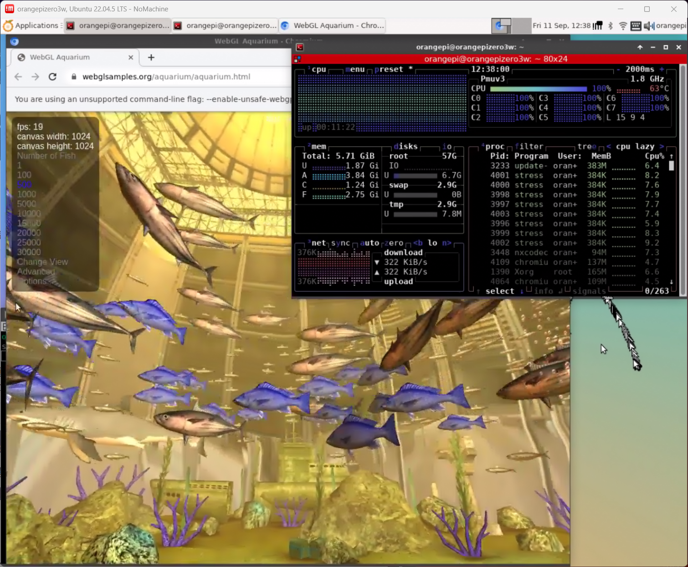

# OrangePiZero3W-FanControl

> Language: **English** | [简体中文](README.zh-CN.md)

A complete temperature-controlled cooling solution for the Orange Pi **Zero3W**: custom CNC aluminum heatsink + 2004/2006 micro PWM fan + Python fan-control script (auto-starts on boot).

The fan speed follows the CPU temperature automatically — **off below 35°C, full speed above 60°C, linear in between** — quiet at low load and cool under heavy load (CPU+GPU dual stress: stable at ~63°C for 10 min at 24°C ambient). This guide is written so beginners can reproduce both the hardware and the software from scratch.

> Related images: pinout diagram at [`img/pin_map.webp`](img/pin_map.webp), actual wiring photo at [`img/pin_connection.jpg`](img/pin_connection.jpg).


---

## Table of Contents

- [Features](#features)
- [Hardware](#hardware)
  - [Bill of Materials (BOM)](#bill-of-materials-bom)
  - [Fan Specs (2004, off-the-shelf)](#fan-specs-2004-off-the-shelf)
  - [CNC Machining (Quanzhou Zhizao / 铨洲智造)](#cnc-machining-quanzhou-zhizao--铨洲智造)
  - [Wiring](#wiring)
- [Software Deployment](#software-deployment)
  - [Prerequisites: Enable the PWM0 Device-Tree Overlay](#prerequisites-enable-the-pwm0-device-tree-overlay)
  - [Option 1: One-Click Install (recommended)](#option-1-one-click-install-recommended)
  - [Option 2: Manual Install](#option-2-manual-install)
- [Verification & Testing](#verification--testing)
- [Temperature Curve & Tuning](#temperature-curve--tuning)
- [How It Works](#how-it-works)
- [Measured Data](#measured-data)
- [Repository Layout](#repository-layout)
- [FAQ](#faq)
- [License](#license)

---

## Features

- ✅ Linear temperature curve: **0% duty at 35°C → 100% at 60°C**, balancing cooling and noise
- ✅ **Hysteresis**: the fan starts only above 36.5°C and stops only below 35°C — no flapping around the threshold
- ✅ **Spin-up kick**: a brief 100% pulse for 0.6 s on startup, so the fan reliably starts at low duty cycles
- ✅ **Minimum running duty 25%**: avoids stall/whine at very low duty cycles
- ✅ **EMA smoothing**: gradual speed changes, no sudden RPM jumps
- ✅ **Fail-safe**: the fan is forced to full speed if temperature reads fail or the process exits; the service auto-restarts on crash
- ✅ **Polarity auto-detection**: this board's PWM output is `inversed` (pin waveform inverted vs. sysfs values); the script compensates automatically, so "duty % in the script = actual fan speed %"
- ✅ **Pure Python stdlib**, no third-party dependencies, ~6 MB RAM

---

## Hardware

### Bill of Materials (BOM)

| Item | Spec | Qty | Source / Notes |
| --- | --- | --- | --- |
| Orange Pi Zero3W | — | 1 | Verified on the official Ubuntu 22.04 image (Orange Pi 1.0.0 Jammy), kernel `6.6.98-sun60iw2` |
| Heatsink body | See `cad_files/HeatSink.SLDPRT` | 1 | Aluminum, **CNC machined to drawing (Quanzhou Zhizao / 铨洲智造)** |
| Heatsink fin | 16×16×6 mm aluminum fin | Per drawing | 🛒 **Off-the-shelf**: [Taobao link](https://item.taobao.com/item.htm?id=725883202144&skuId=5036273268642) |
| Bottom plate / shell | See `cad_files/BottomShell.SLDPRT` | 1 | **CNC machining**, or export an STL and **3D print in PETG** (cheaper) |
| Micro fan | **2004** (20×20×4 mm) or **2006** (20×20×6 mm), 5 V, **PWM speed control** | 1 | 🛒 **Off-the-shelf**: [1688 link (2004)](https://detail.1688.com/offer/841908586658.html), specs below |
| Wires | Dupont wires etc. | Several | See the wiring section below |
| Screws | Per drawing | Several | Heatsink/board mounting |

### Fan Specs (2004, off-the-shelf)

Purchase link: [1688](https://detail.1688.com/offer/841908586658.html) (2006 is the same-footprint compatible size; the CAD reference model is a SENKAYS 2006)

| Parameter | Value |
| --- | --- |
| Dimensions | 20×20×4 mm (2004) |
| Voltage | 5 V |
| Power | 0.34 W |
| Speed | 5000 ~ 15000 RPM |
| Airflow | 0.5 ~ 1.20 CFM |
| Static pressure | 1.83 ~ 8.35 mmH₂O |
| Noise | 15 ~ 29 dB-A |
| Weight | 2 g |

### CNC Machining (Quanzhou Zhizao / 铨洲智造)

The `cad_files/` directory contains SolidWorks drawings:

| File | Description | Production |
| --- | --- | --- |
| `OrangePiZero3W.SLDASM` | Full assembly (fan + board + heatsink) | Reference |
| `HeatSink.SLDPRT` | Heatsink body | ✅ CNC machined part |
| `BottomShell.SLDPRT` | Bottom plate / shell | ✅ CNC machined part; **or export an STL and 3D print in PETG** (cheaper) |
| `Single16x16x6.SLDPRT` | 16×16×6 mm fin unit | 🛒 Off-the-shelf (assembly reference only): [Taobao link](https://item.taobao.com/item.htm?id=725883202144&skuId=5036273268642) |
| `Zero3W.SLDPRT` | Orange Pi Zero3W board model | Reference (not machined) |
| `Fan 2006 (SENKAYS).SLDASM` | 2006 fan assembly (SENKAYS) | 🛒 Off-the-shelf (reference) |

Ordering steps:

1. Open the Quanzhou Zhizao (铨洲智造) website / mini-program and **upload the parts to be machined** (also export a **STEP** copy for the best compatibility);
2. Choose the material (**6061 aluminum** recommended) and surface finish (**sandblasting + anodizing** recommended — better cooling and insulation);
3. The platform quotes automatically; confirm and place the order.

> The drawings are standard SolidWorks format and can be sent to any CNC shop that accepts customer drawings; use STEP format when switching vendors.
>
> If you don't need a metal bottom plate, export `BottomShell.SLDPRT` as an STL and **3D print it in PETG** — much cheaper. The heatsink fin (16×16×6 mm) is an off-the-shelf aluminum part; buy it from the Taobao link above — no machining needed.

### Wiring

Connect the fan to the Zero3W's 40-pin header:

| Fan wire | Zero3W pin | Notes |
| --- | --- | --- |
| **PWM wire** | **PWM0 (PB4)** | See [`img/pin_map.webp`](img/pin_map.webp) for the exact position |
| Positive (+) | 5 V pins (**2/4**) | If your fan is a 3.3 V model, use the 3.3 V pins (**1/17**) |
| Negative (−) | Any GND pin (**6/9/14/20/25/30/34/39**) | — |

Compare with the actual photo [`img/pin_connection.jpg`](img/pin_connection.jpg) before powering on.

> ⚠️ **Caution**: reversing the power wires can damage the fan — double-check against the photo and the pinout diagram first. In this project the PB4 PWM output only carries the speed-control signal; fan power comes from 5 V/GND.

---

## Software Deployment

### Prerequisites: Enable the PWM0 Device-Tree Overlay

The script drives the PB4 PWM output through `/sys/class/pwm/pwmchip0`; the overlay must be enabled first (**fresh images ship with it disabled**):

**Option 1 (GUI, recommended)**:

```bash
sudo orangepi-config
# System -> Hardware -> tick "pwm0" -> Save -> reboot
```

**Option 2 (edit the config directly)**:

```bash
# Edit /boot/orangepiEnv.txt and add pwm0 to the overlays= line
# (separate multiple overlays with spaces)
sudo nano /boot/orangepiEnv.txt
# e.g. overlays=pwm0
sudo reboot
```

**Verify it took effect**:

```bash
ls /sys/class/pwm/
# pwmchip0 must be listed; otherwise re-check the steps above
```

> Note: official images use the default account `orangepi` / `orangepi` (use your own if you changed it); Armbian users can enable the PWM overlay under Hardware in `sudo armbian-config`.

### Option 1: One-Click Install (recommended)

Run on the board:

```bash
# Install git (skip if already installed)
sudo apt update && sudo apt install -y git

# Get this repository
git clone https://github.com/iowqi/OrangePiZero3W-FanControl.git
cd OrangePiZero3W-FanControl

# One-click: install the script + register and start the systemd service
sudo bash install.sh
```

The installer prints the service status at the end — `active (running)` means success. **Afterwards the service starts automatically on every boot**; nothing else to do.

Updating later:

```bash
cd ~/OrangePiZero3W-FanControl
git pull
sudo bash install.sh
```

### Option 2: Manual Install

For no-git / offline setups. From your **PC**, copy the files to the board:

```bash
scp pwm-fan.py pwm-fan.service orangepi@<board-IP>:~/
```

Then SSH into the board:

```bash
sudo install -m 0755 -o root -g root ~/pwm-fan.py /usr/local/sbin/pwm-fan.py
sudo install -m 0644 -o root -g root ~/pwm-fan.service /etc/systemd/system/pwm-fan.service
sudo systemctl daemon-reload
sudo systemctl enable --now pwm-fan.service
```

---

## Verification & Testing

```bash
# 1. Service status ("active (running)" = OK)
systemctl status pwm-fan

# 2. Live log: one "temp xx.x°C -> duty xx%" line per change
journalctl -u pwm-fan -f

# 3. Show current temperature & PWM state
sudo /usr/local/sbin/pwm-fan.py --show

# 4. Manually spin the fan at 50% (checks fan + wiring)
sudo /usr/local/sbin/pwm-fan.py --test 50
```

**Full-load test (optional)**: start 4 busy-loop processes and watch the log — duty automatically ramps to 100% once the temperature passes 60°C:

```bash
for i in 1 2 3 4; do yes > /dev/null & done
journalctl -u pwm-fan -f
# stop the load when done: pkill yes
```

**Boot auto-start check**: `sudo reboot`, log back in, then `systemctl status pwm-fan` — the service should be running within seconds of boot.

---

## Temperature Curve & Tuning

Default curve (**spec: 35°C = 0%, 60°C = 100%**):

| Temperature | Target speed |
| --- | --- |
| ≤ 35°C | 0% (stopped) |
| 35 ~ 60°C | linear 0% → 100% |
| ≥ 60°C | 100% (full speed) |

Extra mechanisms:

| Mechanism | Default | Purpose |
| --- | --- | --- |
| Hysteresis | start at 36.5°C / stop at 35°C | prevents flapping around the threshold |
| Spin-up kick | 100% × 0.6 s | guarantees a reliable start from standstill |
| Minimum running duty | 25% | prevents stall at very low duty cycles |
| EMA smoothing | α=0.35, poll every 3 s | gradual speed changes, less noise |
| Fail-safe | full speed | keeps cooling when temperature reads fail or the process exits |

All parameters live at the top of `pwm-fan.py`; **edit and run `sudo systemctl restart pwm-fan` to apply**:

| Parameter | Default | Meaning |
| --- | --- | --- |
| `TEMP_MIN` / `TEMP_MAX` | 35.0 / 60.0 | stop / full-speed temperatures (curve endpoints) |
| `TEMP_ON` / `TEMP_OFF` | 36.5 / 35.0 | hysteresis start / stop thresholds |
| `MIN_DUTY` | 25.0 | minimum duty % while running |
| `KICK_DUTY` / `KICK_SECONDS` | 100.0 / 0.6 | spin-up duty % and duration |
| `POLL_INTERVAL` | 3.0 | temperature polling period (s) |
| `EMA_ALPHA` | 0.35 | smoothing factor 0~1, larger = faster response |
| `FORCE_INVERT` | `None` | polarity mapping: auto / `True` / `False` (see below) |
| `FAILSAFE_DUTY` | 100.0 | safe duty % applied on failure |
| `PWM_PERIOD_NS` | 40000 | 25 kHz, normally leave unchanged |

### About the "inversed" Polarity (important)

On this board the PWM0 pin waveform is **inverted** relative to the sysfs `duty_cycle` value: writing `duty_cycle=40000` drives the pin low (fan stopped), while writing `0` drives it high (full speed). The script detects the polarity and **inverts the mapping automatically**, so the duty % in the script always equals the actual fan speed % — you don't need to care about this detail.

Only touch it if a different fan circuit reverses the direction: set `FORCE_INVERT` to `True` or `False` to force the mapping. The startup log prints the active mapping (`映射取反(inversed)` / `映射直通`); check it with `journalctl -u pwm-fan -n 20`.

---

## How It Works

1. **Read temperature**: the script scans `/sys/class/thermal/thermal_zone*/type`, picks every node whose type contains `cpu`, and takes the **maximum** (covers big.LITTLE clusters; values are in millidegrees Celsius);
2. **Compute duty**: apply the curve above plus hysteresis/smoothing to obtain the target duty cycle;
3. **Write PWM**: set the 25 kHz period and duty via sysfs (`/sys/class/pwm/pwmchip0/pwm0`) — no extra driver required;
4. **Run as a service**: systemd starts it at boot and restarts it on crash (`Restart=always`); logs go to `journalctl`.

---

## Measured Data

Recorded on a Zero3W running this repository's code (stress = 4-core `yes` busy-loop unless noted):

| Scenario | Temperature | Fan |
| --- | --- | --- |
| Idle | ~48 ~ 50°C | ~50 ~ 60% duty |
| Full load, fan forced off | climbed 49 → 64°C within 90 s | 0% (control group, verifies wiring direction) |
| Full load, automatic control | duty hits 100% at ~62°C | 100%, stable at 62 ~ 64°C |
| 30 s after load ends | back to ~54°C | duty ramps down smoothly |
| **CPU+GPU dual stress, 10 min** | **stable at ~63°C (24°C ambient)** | **100% (the curve gives full speed at 60°C)**, chart below |
| After reboot | service auto-starts and takes over PWM within 4 s | normal |



> CPU+GPU dual stress for 10 minutes: temperature stable at ~63°C (24°C ambient), no thermal throttling.

---

## Repository Layout

```
OrangePiZero3W-FanControl
├── README.md                     # This document (English, shown by default)
├── README.zh-CN.md               # 简体中文文档
├── LICENSE                       # MIT License
├── pwm-fan.py                    # Fan-control main program (Python3 stdlib)
├── pwm-fan.service               # systemd service unit
├── install.sh                    # One-click installer (run on the board)
├── img
│   ├── pin_map.webp              # Zero3W 40-pin header pinout diagram
│   ├── pin_connection.jpg        # Actual fan-to-board wiring photo
│   └── benchmark.png             # CPU+GPU 10-min dual-stress temperature chart (~63°C stable)
├── cad_files                     # SolidWorks drawings (for CNC machining)
│   ├── OrangePiZero3W.SLDASM     # Full assembly
│   ├── HeatSink.SLDPRT           # Heatsink body (CNC machined part)
│   ├── BottomShell.SLDPRT        # Bottom plate (CNC machining or PETG 3D print)
│   ├── Single16x16x6.SLDPRT      # 16×16×6 mm fin unit (off-the-shelf; Taobao link above)
│   ├── Zero3W.SLDPRT             # Board reference model
│   └── Fan 2006 (SENKAYS).SLDASM # 2006 fan assembly (off-the-shelf part)
└── scripts                       # Dev/verification helper scripts (optional reading)
    ├── remote_check.sh           # Remote survey of PWM/temperature interfaces
    ├── test_on_board.sh          # Fake-temperature-file logic test
    ├── temp_verify.sh            # Full-load temperature-response experiment (confirms fan direction)
    ├── demo_verify.sh            # Closed-loop service stress demo
    └── verify_boot.sh            # Boot auto-start verification
```

> The scripts under `scripts/` are development-time verification tools; adjust IP addresses and paths to your environment. For reference only.

---

## FAQ

**1. Fan doesn't spin at all?**

- Confirm the PWM0 overlay is enabled: `ls /sys/class/pwm/` must list `pwmchip0`;
- Confirm the wiring matches [`img/pin_connection.jpg`](img/pin_connection.jpg);
- Check the log: `journalctl -u pwm-fan -n 50`;
- Manual test: `sudo /usr/local/sbin/pwm-fan.py --test 100` (full speed) and `--test 0` (stop).

**2. Temperature rises but the fan doesn't speed up?**

Look at the "temp → duty" lines in the log: if the duty rises but the fan doesn't react, it's a wiring/fan issue; if the duty doesn't rise, check the temperature source (use `--show` to see the current temperature).

**3. Fan runs at full speed and never slows down?**

The polarity mapping is reversed: run `sudo /usr/local/sbin/pwm-fan.py --show` to check `polarity`, then set `FORCE_INVERT` to the opposite value as described above.

**4. The fan keeps spinning at idle — is that normal?**

Yes. This board idles around 48~50°C, which the curve maps to 50~60% duty. If the idle noise bothers you, raise `TEMP_ON`/`TEMP_OFF` (e.g. 42/40°C to stay stopped at idle) or shift the whole curve to the right.

**5. Service didn't come back after a reboot?**

- `systemctl is-enabled pwm-fan` should print `enabled`;
- Make sure the overlay line in `/boot/orangepiEnv.txt` was saved;
- Check `systemctl status pwm-fan` for errors.

**6. Want to poke the sysfs interface manually?**

```bash
echo 0    | sudo tee /sys/class/pwm/pwmchip0/export     # export the channel (once)
echo 40000 | sudo tee /sys/class/pwm/pwmchip0/pwm0/period  # 25 kHz
echo 1    | sudo tee /sys/class/pwm/pwmchip0/pwm0/enable   # enable the output
echo 0    | sudo tee /sys/class/pwm/pwmchip0/pwm0/duty_cycle   # on this board = full speed
echo 40000 | sudo tee /sys/class/pwm/pwmchip0/pwm0/duty_cycle  # on this board = stop
```

---

## License

Code is under the [MIT License](LICENSE). The drawings in `cad_files/` and the images in `img/` are copyrighted by the author; do not use them commercially without permission.
